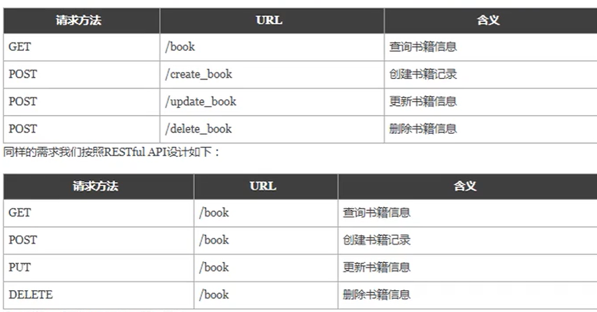

- 简单快速

客户向服务器请求服务时,只需传送**请求方法和路径**

- 无状态
- cookie和session

# HTTP报文结构

## HTTP request HEAD

**method**: GET

path: 

scheme: https

**accept**: application/json, text/javascript, \*/\*; q=0.01

accept-encoding: identity

**accept-language**: zh-CN,zh;q=0.9,en-US;q=0.8,en;q=0.7

**cache-control**: no-cache

**content-type: application/x-www-form-urlencoded; charset=UTF-8**

**cookie: CURRENT_FNVAL=16; buvid3=269248A3-AB3A-4DFD-AAC6-9B705909860147162infoc; _uuid=7BB93A8E-8732-4DA6-657A-3E94E8D4FCBA62479infoc;** 

origin: https://www.bilibili.com

pragma: no-cache

range: bytes=3991402-4099180

referer: https://www.bilibili.com/video/BV1bk4y1r7Qr?p=10

sec-fetch-dest: empty

sec-fetch-mode: cors

sec-fetch-site: cross-site

**user-agent**: Mozilla/5.0 (Windows NT 10.0; Win64; x64) AppleWebKit/537.36 (KHTML, like Gecko) Chrome/81.0.4044.138 Safari/537.36

## response head

access-control-allow-credentials: true

access-control-allow-headers: Origin,No-Cache,X-Requested-With,If-Modified-Since,Pragma,Last-Modified,Cache-Control,Expires,Content-Type,Access-Control-Allow-Credentials,DNT,X-CustomHeader,Keep-Alive,User-Agent,X-Cache-Webcdn,x-bilibili-key-real-ip

access-control-allow-origin: https://www.bilibili.com

bili-status-code: 0

bili-trace-id: 320bd56fd15ebead

**Connection: keep-alive**

content-length: 32

**content-type: application/json; charset=utf-8**

date: Fri, 15 May 2020 14:55:53 GMT

**status: 200**

x-cache-webcdn: BYPASS from hw-sh3-webcdn-10

# 响应报文


# get和post的区别

get由于不能传递body,所以要把数据写在uri里

post可以传递body




# HTTP状态码

200,204,206

301 Moved Permanently 永久重定向

302 Found 临时重定向

304 Not modified 未修改使用本地缓存

# HTTP  状态管理

cookie 和 session

# cookie


# session


# url和uri

- URL：Uniform Resource Locator 统一资源定位符
- URN：Uniform Resource Name  统一资源名称
- URI：Uniform Resource Identifier

URI,可以分为`URL,URN`或同时具备locators和names特性的

`URN`作用就好像一个人的名字, URL就像一个人的地址

换句话说,URN,确定了东西的身份, URL提供了找到它的方式

# URI

```txt
URI = scheme:[//authority]path[?query][#fragment]
```

where the authority component divides into three *subcomponents*:

```
authority = [userinfo@]host[:port]
```

```
          userinfo       host      port
          ┌──┴───┐ ┌──────┴──────┐ ┌┴┐
  https://john.doe@www.example.com:123/forum/questions/?tag=networking&order=newest#top
  └─┬─┘   └───────────┬──────────────┘└───────┬───────┘ └───────────┬─────────────┘ └┬┘
  scheme          authority                  path                 query           fragment

  ldap://[2001:db8::7]/c=GB?objectClass?one
  └┬─┘   └─────┬─────┘└─┬─┘ └──────┬──────┘
  scheme   authority   path      query

  mailto:John.Doe@example.com
  └─┬──┘ └────┬─────────────┘
  scheme     path

  news:comp.infosystems.www.servers.unix
  └┬─┘ └─────────────┬─────────────────┘
  scheme            path

  tel:+1-816-555-1212
  └┬┘ └──────┬──────┘
  scheme    path

  telnet://192.0.2.16:80/
  └─┬──┘   └─────┬─────┘│
  scheme     authority  path

  urn:oasis:names:specification:docbook:dtd:xml:4.1.2
  └┬┘ └──────────────────────┬──────────────────────┘
  scheme                    path
```

[格式不会乱的wiki](https://en.wikipedia.org/wiki/Uniform_Resource_Identifier#Examples_2)

## URL

URL的主要格式为：

`<协议>:<特定协议部分>`

协议(scheme)指定了以何种方式取得资源。一些协议名的例子有：

- ftp(文件传输协议，File Transfer Protocol)
- http(超文本传输协议，Hypertext Transfer Protocol)
- mailto(电子邮件)
- file(特定主机文件名)

协议之后跟随冒号，特定协议部分的格式则为：

`//<用户>:<密码>@<主机>:<端口号>/<路径>`

## URN

urn:[issn](https://zh.wikipedia.org/w/index.php?title=国际标准序列号&action=edit&redlink=1)<XSLT>:1535-3613


## 区别

- URL是URI的一种, 但不是所有的URI都是URL
- URI和URL最大的差别是"访问机制", (如FTP/HTTP)
- URN是唯一标识的一部分, 是身份信息