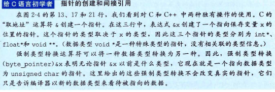

# 基础知识
- 运算符 算子
  a = b + 5
  运算符(=, +)
  算子 (a, b, 5)

- 运算符优先级

  | 优先级 | 运算符                  | 运算     | 结合关系 | 举例  |
  | ------ | ----------------------- | -------- | -------- | ----- |
  | 1      | + (其实就是b的正负取反) | 单目不变 | 自右向左 | a*+b  |
  | 1      | -                       | 单目不变 | 自右向左 | a*-b  |
  | 2      | *                       | 乘       | 自左向右 | a*b   |
  | 2      | %                       | 取余     | 自左向右 | a%b   |
  |8 | >= | 大于等于| 自左向右 |a >= b|
  |9|== != | 等于 不等于| 自左向右 |a==b a!=b|
  | 16     | =                       | 赋值     | 自右向左 | a = b |


  相同优先级[运算符](https://baike.baidu.com/item/运算符)，从左至右依次运算。注意后缀运算优先级高于前缀。因此++i++应解释为++(i++)。

  - 前缀后缀

    | 表达式  | 运算       | 表达式的值      |
    | ------- | ---------- | --------------- |
    | count++ | 给count加1 | count原来的值   |
    | ++count | 给count加1 | count+1以后的值 |
    | --count | 给count减1 | count-1以后的值 |

    

# 要点注意

```
# c99
const  常量

```
## 变量命名
- 标识符只能由字母、数字、下划线组成，数字不可以出现在第一个位置
- 开头不能是数字
- 不能有=-等。如monkey-king 

## 初始化

`int a, b = 0;` b 被初始化为0, 虽然打印的时候a = 0; 但是 a 没有被初始化

## scanf

scanf 是你怎么打他就要求输入什么
```
scanf(%d %d, &i, &j)
$ 1 2
scanf(%d-%d, &i, &j)
$ 1-2
```

# cast 强制类型转换



# union 联合