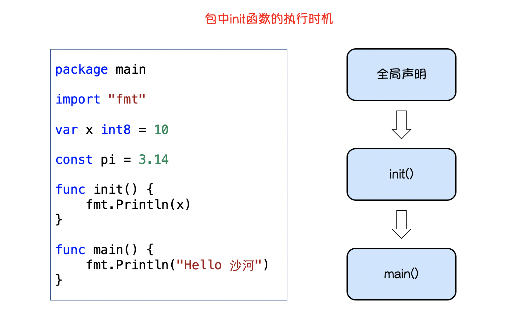

## 匿名导入包

如果只希望导入包，而不使用包内部的数据时，可以使用匿名导入包。具体的格式如下：

```go
import _ "包的路径"
```

匿名导入的包与其他方式导入的包一样都会被编译到可执行文件中。

## init()初始化函数

### init()函数介绍

在Go语言程序执行时导入包语句会自动触发包内部`init()`函数的调用。需要注意的是： `init()`函数没有参数也没有返回值。 `init()`函数在程序运行时自动被调用执行，不能在代码中主动调用它。

包初始化执行的顺序如下图所示：

main包 --> import --> 全局const -> 全局var --> init() --> main()

> 如果一个main包引入了别的包, 初始化顺序是先初始化被引用的包

一个man包中可以有多个init()

### init()函数执行顺序

Go语言包会从`main`包开始检查其导入的所有包，每个包中又可能导入了其他的包。Go编译器由此构建出一个树状的包引用关系，再根据引用顺序决定编译顺序，依次编译这些包的代码。

在运行时，被最后导入的包会最先初始化并调用其`init()`函数， 如下图示：