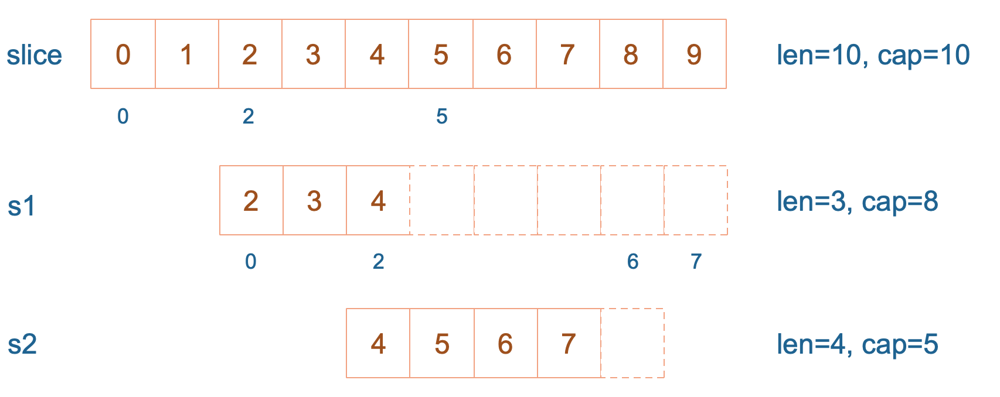
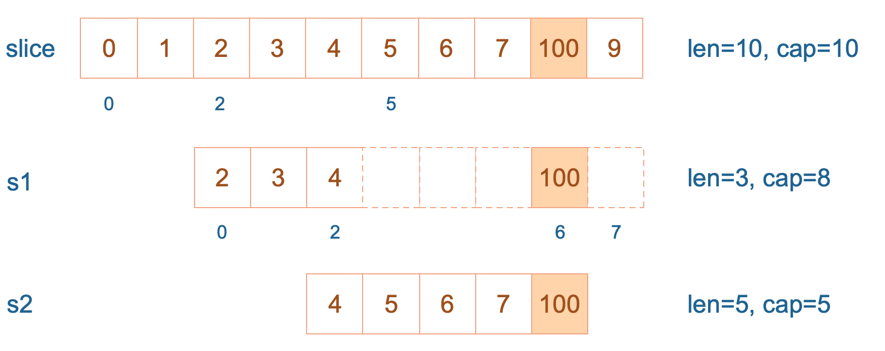
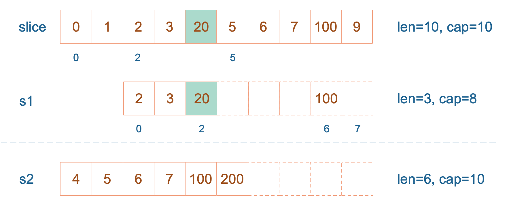

```go
package main

import (
	"fmt"
)

func main() {
	card := []int{3,4}
	fmt.Println("cap==>",cap(card),len(card))
	a := card[2:] // 这里为什么不报错
	fmt.Println(a)
	fmt.Printf("%#v,%p\n",card,&card)
	fmt.Printf("%#v,%p\n",a,&card)

}
```

## 切片的赋值拷贝

下面的代码中演示了拷贝前后两个变量共享底层数组，对一个切片的修改会影响另一个切片的内容，这点需要特别注意。

```go
func main() {
	s1 := make([]int, 3) //[0 0 0]
	s2 := s1             //将s1直接赋值给s2，s1和s2共用一个底层数组
	s2[0] = 100
	fmt.Println(s1) //[100 0 0]
	fmt.Println(s2) //[100 0 0]
}
```

## append()方法为切片添加元素

Go语言的内建函数`append()`可以为切片动态添加元素。 每个切片会指向一个底层数组，这个数组能容纳一定数量的元素。当底层数组不能容纳新增的元素时，切片就会自动按照一定的策略进行“扩容”，此时该切片指向的底层数组就会更换。“扩容”操作往往发生在`append()`函数调用时。 举个例子：

```go
func main() {
	//append()添加元素和切片扩容
	var numSlice []int
	for i := 0; i < 10; i++ {
		numSlice = append(numSlice, i)
		fmt.Printf("%v  len:%d  cap:%d  ptr:%p\n", numSlice, len(numSlice), cap(numSlice), numSlice)
	}
}
```

输出：

```bash
[0]  len:1  cap:1  ptr:0xc0000a8000
[0 1]  len:2  cap:2  ptr:0xc0000a8040
[0 1 2]  len:3  cap:4  ptr:0xc0000b2020
[0 1 2 3]  len:4  cap:4  ptr:0xc0000b2020
[0 1 2 3 4]  len:5  cap:8  ptr:0xc0000b6000
[0 1 2 3 4 5]  len:6  cap:8  ptr:0xc0000b6000
[0 1 2 3 4 5 6]  len:7  cap:8  ptr:0xc0000b6000
[0 1 2 3 4 5 6 7]  len:8  cap:8  ptr:0xc0000b6000
[0 1 2 3 4 5 6 7 8]  len:9  cap:16  ptr:0xc0000b8000
[0 1 2 3 4 5 6 7 8 9]  len:10  cap:16  ptr:0xc0000b8000
```

从上面的结果可以看出：

1. `append()`函数将元素追加到切片的最后并返回该切片。
2. 切片numSlice的容量按照1，2，4，8，16这样的规则自动进行扩容，每次扩容后都是扩容前的2倍。

append()函数还支持一次性追加多个元素。 例如：

```go
var citySlice []string
// 追加一个元素
citySlice = append(citySlice, "北京")
// 追加多个元素
citySlice = append(citySlice, "上海", "广州", "深圳")
// 追加切片
a := []string{"成都", "重庆"}
citySlice = append(citySlice, a...) // 表示拆开
fmt.Println(citySlice) //[北京 上海 广州 深圳 成都 重庆]
```

## 切片的扩容策略

可以通过查看`$GOROOT/src/runtime/slice.go`源码，其中扩容相关代码如下：

```go
newcap := old.cap
doublecap := newcap + newcap
if cap > doublecap {
	newcap = cap
} else {
	if old.len < 1024 {
		newcap = doublecap
	} else {
		// Check 0 < newcap to detect overflow
		// and prevent an infinite loop.
		for 0 < newcap && newcap < cap {
			newcap += newcap / 4
		}
		// Set newcap to the requested cap when
		// the newcap calculation overflowed.
		if newcap <= 0 {
			newcap = cap
		}
	}
}
```

从上面的代码可以看出以下内容：

- 首先判断，如果新申请容量（cap）大于2倍的旧容量（old.cap），最终容量（newcap）就是新申请的容量（cap）。
- 否则判断，如果旧切片的长度小于1024，则最终容量(newcap)就是旧容量(old.cap)的两倍，即（newcap=doublecap），
- 否则判断，如果旧切片长度大于等于1024，则最终容量（newcap）从旧容量（old.cap）开始循环增加原来的1/4，即（newcap=old.cap,for {newcap += newcap/4}）直到最终容量（newcap）大于等于新申请的容量(cap)，即（newcap >= cap）
- 如果最终容量（cap）计算值溢出，则最终容量（cap）就是新申请容量（cap）。

需要注意的是，切片扩容还会根据切片中元素的类型不同而做不同的处理，比如`int`和`string`类型的处理方式就不一样。

## 截取

截取也是比较常见的一种创建 slice 的方法，可以从数组或者 slice 直接截取，当然需要指定起止索引位置。

基于已有 slice 创建新 slice 对象，被称为 `reslice`。新 slice 和老 slice 共用底层数组，新老 slice 对底层数组的更改都会影响到彼此。基于数组创建的新 slice 对象也是同样的效果：对数组或 slice 元素作的更改都会影响到彼此。

值得注意的是，新老 slice 或者新 slice 老数组互相影响的前提是两者共用底层数组，如果因为执行 `append` 操作使得新 slice 底层数组扩容，移动到了新的位置，两者就不会相互影响了。所以，**问题的关键在于两者是否会共用底层数组**。

截取操作采用如下方式：

```go
 data := [...]int{0, 1, 2, 3, 4, 5, 6, 7, 8, 9}
 slice := data[2:4:6] // data[low, high, max]
```

对 `data` 使用3个索引值，截取出新的 `slice`。这里 `data` 可以是数组或者 `slice`。`low` 是最低索引值，这里是闭区间，也就是说第一个元素是 `data` 位于 `low` 索引处的元素；而 `high` 和 `max` 则是开区间，表示最后一个元素只能是索引 `high-1` 处的元素，而最大容量则只能是索引 `max-1` 处的元素。

```txt
max >= high >= low
```

当 `high == low` 时，新 `slice` 为空。

还有一点，`high` 和 `max` 必须在老数组或者老 `slice` 的容量（`cap`）范围内。

说明：例子来自雨痕大佬《Go学习笔记》第四版，P43页。这里我会进行扩展，并会作图详细分析。

```go
package main

import "fmt"

func main() {
	slice := []int{0, 1, 2, 3, 4, 5, 6, 7, 8, 9}
	s1 := slice[2:5]
    s2 := s1[2:6:7] // 改成s1[2:6:8]

	s2 = append(s2, 100)
	s2 = append(s2, 200)

	s1[2] = 20

	fmt.Println(s1)
	fmt.Println(s2)
	fmt.Println(slice)
}
```

结果：

```
[2 3 20]
[4 5 6 7 100 200]
[0 1 2 3 20 5 6 7 100 9]
```

`s1` 从 `slice` 索引2（闭区间）到索引5（开区间，元素真正取到索引4），长度为3，容量默认到数组结尾，为8。 

`s2` 从 `s1` 的索引2（闭区间）到索引6（开区间，元素真正取到索引5），容量到索引7（开区间，真正到索引6），为5。



接着，向 `s2` 尾部追加一个元素 100：

```
s2 = append(s2, 100)
```

`s2` 容量刚好够，直接追加。不过，这会修改原始数组对应位置的元素。这一改动，数组和 `s1` 都可以看得到。



再次向 `s2` 追加元素200：

```
s2 = append(s2, 100)
```

这时，`s2` 的容量不够用，该扩容了。于是，`s2` 另起炉灶，将原来的元素复制新的位置，扩大自己的容量。并且为了应对未来可能的 `append` 带来的再一次扩容，`s2` 会在此次扩容的时候多留一些 `buffer`，将新的容量将扩大为原始容量的2倍，也就是10了。


最后，修改 `s1` 索引为2位置的元素：

```
s1[2] = 20
```

这次只会影响原始数组相应位置的元素。它影响不到 `s2` 了，人家已经远走高飞了。



再提一点，打印 `s1` 的时候，只会打印出 `s1` 长度以内的元素。所以，只会打印出3个元素，虽然它的底层数组不止3个元素。

# 一个有趣的例子

```go
package main

import (
	"fmt"
)

func main() {
	//case 1
	a := []int{}
	a = append(a, 1)
	a = append(a, 2)
	b := append(a, 3)
	c := append(a, 4)
	fmt.Println("a: ", a, "\nb: ", b, "\nc: ", c)
	fmt.Printf("a len %d, a cap %d\n", len(a), cap(a))
	fmt.Printf("b len %d, b cap %d\n", len(b), cap(b))
	fmt.Printf("c len %d, c cap %d\n", len(c), cap(c))
	
	//case 2
	a = append(a, 3)
	x := append(a, 4)
	y := append(a, 5)
	fmt.Println("a: ", a, "\nx: ", x, "\ny: ", y)
	fmt.Printf("a len %d, a cap %d\n", len(a), cap(a))
	fmt.Printf("x len %d, x cap %d\n", len(x), cap(x))
	fmt.Printf("y len %d, y cap %d\n", len(y), cap(y))
}
/*
a's pointer is c00000a4a0
x's pointer is c00000a4a0
a's pointer is c00000a4a0
y's pointer is c00000a4a0
a:  [1 2 3]
x:  [1 2 3 5]
y:  [1 2 3 5]
a len 3, a cap 4
x len 4, x cap 4
y len 4, y cap 4
*/
```

其他的都是输出都是常规操作，可能很多人对这个x的输出感到诧异，为什么是1 2 3 5，而不是 1 2 3 4.这是因为，他们都是切片，切片底层公用一个数组。x和y都是指针，指向同一个底层数组。
当在操作b和c时候，由于超过了数组的slice的cap容量，会触发扩容操作，所以b和c分别指向了两个不同的新数组。而当x和y追加操作时，并未触发新数组创建，x和y指向同一个底层数组，所以在
x追加操作时，传入的是a的指针, 返回的仍然是a的指针, 但是赋值给了x, 没有赋值给a,  所以返回len 4和a的容量4。
y追加操作时，传入的是a的指针,返回的仍然是a的指针，len是4和a的容量4。
原文链接：https://blog.csdn.net/u010278923/java/article/details/87093383

## copy

func copy (dst []Type, src []Type) int
用于将源slice的数据（第二个参数），复制到目标slice（第一个参数）。

返回值为拷贝了的数据个数，是len(dst)和len(src)中的最小值。
```go
var a = []int{0, 1, 2, 3, 4, 5, 6, 7}
var s = make([]int, 6) // 使用copy的话 切片长度不能为0

//源长度为8，目标为6，只会复制前6个

n1 := copy(s, a)
fmt.Println("s - ", s)
fmt.Println("n1 - ", n1)

 //s - [0 1 2 3 4 5]
//n1 - 6

//源长为7，目标为6，复制索引1到6

n2 := copy(s, a[1:])
fmt.Println("s - ", s)
fmt.Println("n2 - ", n2)
//  s - [1 2 3 4 5 6]
// n2 - 6 

//源长为8-5=3，只会复制3个值，目标中的后三个值不会变

n3 := copy(s, a[5:])
fmt.Println("s - ", s)
fmt.Println("n3 - ", n3)

// s - [5 6 7 4 5 6]
// n3 - 3

//将源中的索引5,6,7复制到目标中的索引3,4,5

n4 := copy(s[3:], a[5:])

fmt.Println("s - ", s)

fmt.Println("n4 - ", n4)
// s - [5 6 7 5 6 7]
// n4 - 3
```