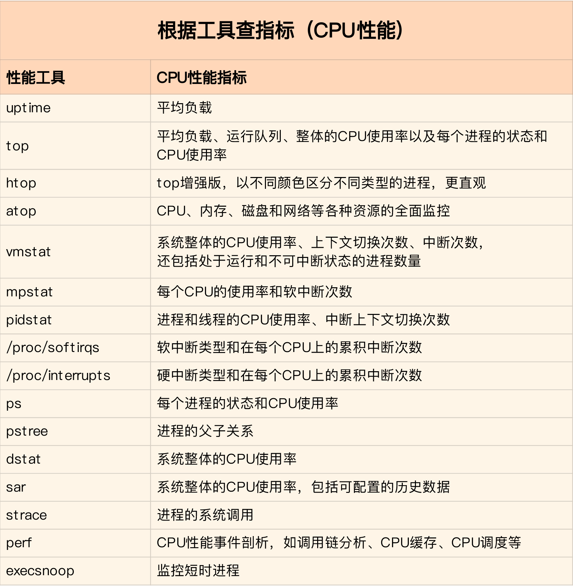

# 工具篇
## 压测工具
#### stress 

是一个 Linux 系统压力测试工具，这里我们用作异常进程模拟平均负载升高的场景。

>  iowait无法升高的问题，是因为案例中stress使用的是 sync() 系统调用，它的作用是刷新缓冲区内存到磁盘中。对于新安装的虚拟机，缓冲区可能比较小，无法产生大的IO压力，这样大部分就都是系统调用的消耗了。所以，你会看到只有系统CPU使用率升高。解决方法是使用stress的下一代stress-ng，它支持更丰富的选项，比如 stress-ng -i 1 --hdd 1 --timeout 600（--hdd表示读写临时文件）。

```
 stress --cpu 1 --timeout 600 // cpu
 stress -i 1 --timeout 600 // io
 stress -c 8  --timeout 600 // 大量进程
```
#### hping3 

是一个可以构造 TCP/IP 协议数据包的工具，可以对系统进行安全审计、防火墙测试等。
```
 -S参数表示设置TCP协议的SYN（同步序列号），
 -p表示目的端口为80
 -i u100表示每隔100微秒发送一个网络帧
```
## 排查工具
#### sysstat 

包含了常用的 Linux 性能工具，用来监控和分析系统的性能。我们的案例会用到这个包的两个命令 mpstat 和 pidstat。

- ```
  # sar 2 5       --> will report CPU utilization every two seconds, five times.
  # sar -n DEV 3  --> will report network device utilization every 3 seconds, in an infinite loop.
  ```
#### mpstat 
是一个常用的多核 CPU 性能分析工具，用来实时查看每个 CPU 的性能指标，以及所有 CPU 的平均指标。


#### vmstat

```shell
# 每隔5秒输出1组数据
$ vmstat 5
procs -----------memory---------- ---swap-- -----io---- -system-- ------cpu-----
 r  b   swpd   free   buff  cache   si   so    bi    bo   in   cs us sy id wa st
 0  0      0 7005360  91564 818900    0    0     0     0   25   33  0  0 100  0  0
```
  * cs(context switch) 每秒上下文切换的次数

  * in(interrupt) 每秒终端的次数

  * r (Running or Runnable)就绪队列的长度, 也就是正在运行和等待CPU的进程数

  * b(Blocked) 处于不可中断睡眠状态的进程数

  * bi  块设备的读取

  * bo 块设备的写入

    > 单位为块 / 秒。因为 Linux 中块的大小是 1KB，所以这个单位也就等价于 KB/s。

#### sar 

是一个系统活动报告工具，既可以实时查看系统的当前活动，又可以配置保存和报告历史统计数据。

```
 -n DEV // 网卡收发
 -r // 显示内存使用情况
 -S // 显示Swap使用情况
```

#### pidstat 

是一个常用的进程性能分析工具，用来实时查看进程的 CPU、内存、I/O 以及上下文切换等性能指标

`pidstat -wut -p XX 1`

```shell
pidstat -u 5 1 # 5秒内的cpu变化 输出一次
pidstat -d 5 1 #              io
# 还有很多options man一下吧 
```

```
pidstat -w 5 # 每隔5秒输出一组进程task上下文切换 Report task switching activity
Average:      UID       PID   cswch/s nvcswch/s  Command
Average:        0         1      0.50      0.00  systemd
Average:        0         3      0.30      0.00  ksoftirqd/0
Average:        0         7      0.15      0.00  migration/0
Average:        0         9     37.16      0.00  rcu_sched
Average:        0        11      0.25      0.00  watchdog/0
Average:        0        12      0.25      0.00  watchdog/1

pidstat -wt 1 # -t输出线程的指标 
```

- cswch(voluntary context switches) 每秒自愿上下文切换的次数
- nvcswch(non voluntary context switches)每秒非自愿上下文切换的次数

>  pidstat -u 中， %wait 表示进程等待 CPU 的时间百分比。
>
> top 中 ，iowait% 则表示等待 I/O 的 CPU 时间百分比。
>
> 等待 CPU 的进程已经在 CPU 的就绪队列中，处于运行状态；而等待 I/O 的进程则处于不可中断状态。

#### top

top 默认使用 3 秒时间间隔的CPU 节拍数所算出的使用率

`top -H -p XX 1`

```txt
c 显示参数
H 显示线程
P 按cpu排序
M 按内存排序
N PID排序
T 则按照消耗的计算时间进行排序。
V  进程树显示
R 优先级显示
s 改变监控间隔
z，能让显示带颜色
按大写字母X，再输入数字3，则能增大每列的宽度，可以让USER栏显示全用户名。
按数字键2，可以显示每颗物理CPU的使用率；按数字键1，则显示每个CPU线程的使用率；按数字键3，再输入数字选择物理CPU，以显示对应CPU的各线程使用率。
```
you can interactively choose which column to sort on
press `f` /`F `/`Shift+f` to enter the interactive menu
press the up or down arrow until the `%MEM` choice is highlighted
press `s` to select `%MEM` choice
press `q` to exit the interactive menu

#### ps

进程的整个生命周期的 cpu节拍数所算出的使用率

`ps mp 进程ID -o THREAD,tid` == `pstree`

#### dstat

io分析利器

#### strace  

正是最常用的跟踪进程系统调用的工具。

`-p PID`

#### pstree

找父进程分析D/Z状态

` pstree -aps PID` // 找出其父进程

---

### 内存

#### free 

输出的是一个表格，其中的数值都默认以字节为单位。表格总共有两行六列，这两行分别是物理内存 Mem 和交换分区 Swap 的使用情况，而六列中，每列数据的含义分别为：

- 第一列，total 是总内存大小；

- 第二列，used 是已使用内存的大小，包含了共享内存；

- 第三列，free 是未使用内存的大小；

- 第四列，shared 是共享内存的大小；

- 第五列，buff/cache 是缓存和缓冲区的大小；

- 最后一列，available 是新进程可用内存的大小。

  > available 不仅包含未使用内存，还包括了可回收的缓存

#### pmap 
`pmap [pid]`
查看某个进程的详细内存情况 report memory map of a process

#### dmesg 
print or control the kernel ring buffer

`dmesg |grep -E 'kill|oom|out of memory'`

### bbc套件 

4.1以上的内核
```shell
sudo apt-key adv --keyserver keyserver.ubuntu.com --recv-keys 4052245BD4284CDD
echo "deb https://repo.iovisor.org/apt/xenial xenial main" | sudo tee /etc/apt/sources.list.d/iovisor.list
sudo apt-get update
sudo apt-get install -y bcc-tools libbcc-examples linux-headers-$(uname -r)
export PATH=$PATH:/usr/share/bcc/tools
```

#### cachestat 

提供了整个操作系统缓存的读写命中情况。

- TOTAL ，表示总的 I/O 次数

- MISSES ，表示缓存未命中的次数

- HITS ，表示缓存命中的次数

- DIRTIES， 表示新增到缓存中的脏页数

- BUFFERS_MB 表示 Buffers 的大小，以 MB 为单位

- CACHED_MB 表示 Cache 的大小，以 MB 为单位

#### cachetop 

提供了每个进程的缓存命中情况。

而 READ_HIT 和 WRITE_HIT ，分别表示读和写的缓存命中率。


## 套件
#### perf

性能事件采样为基础, 可以划分为3类

- Hardware Event 是由 PMU 硬件产生的事件，比如 cache 命中，当您需要了解程序对硬件特性的使用情况时，便需要对这些事件进行采样；
- Software Event 是内核软件产生的事件，比如进程切换，tick 数等 ;
- Tracepoint event 是内核中的静态 tracepoint 所触发的事件，这些 tracepoint 用来判断程序运行期间内核的行为细节，比如 slab 分配器的分配次数等。
```shell
git clone --depth 1 https://github.com/brendangregg/perf-tools
```

##### perf top

- Overhead ，是该符号的性能事件在所有采样中的比例，用百分比来表示。
- Shared ，是该函数或指令所在的动态共享对象（Dynamic Shared Object），如内核、进程名、动态链接库名、内核模块名等。
- Object ，是动态共享对象的类型。比如 [.] 表示用户空间的可执行程序、或者动态链接库，而 [k] 则表示内核空间。
- Symbol 是符号名，也就是函数名。当函数名未知时，用十六进制的地址来表示。

##### perf record

`perf record -ag -- sleep 2;perf report`

perf top 和 perf record 加上 -g 参数，开启调用关系的采样，方便我们根据调用链来分析性能问题。

##### perf report

**指定符号路径为容器文件系统的路径**。比如对于第 05 讲的应用，你可以执行下面这个命令：

```shell
mkdir /tmp/foo
PID=$(docker inspect --format {{.State.Pid}} phpfpm)
bindfs /proc/$PID/root /tmp/foo
perf report --symfs /tmp/foo
# 使用完成后不要忘记解除绑定
umount /tmp/foo/
```




#### tcpdump 

是一个常用的网络抓包工具，常用来分析各种网络问题。

```
-i 指定网卡
-n 不解析主机名和协议名
tcp port 80 表示只抓取tcp协议并且端口号为80的网络帧
```

