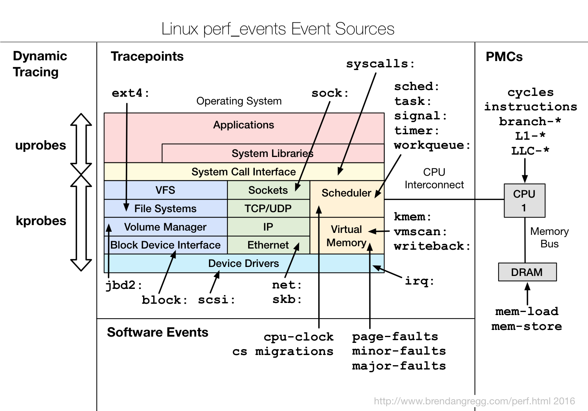

# 动态追踪(Dynamic Tracing)

动态追踪技术，通过探针机制，来采集内核或者应用程序的运行信息，从而可以不用修改内核和应用程序的代码，就获得丰富的信息，帮你分析、定位想要排查的问题。

以往，在排查和调试性能问题时，我们往往需要先为应用程序设置一系列的断点（比如使用 GDB），然后以手动或者脚本（比如 GDB 的 Python 扩展）的方式，在这些断点处分析应用程序的状态。或者，增加一系列的日志，从日志中寻找线索。

动态追踪的事件源
根据事件类型的不同，动态追踪所使用的事件源，可以分为静态探针、动态探针以及硬件事件等三类。

The types of events are:

- **Hardware Events**: CPU performance monitoring counters.
- **Software Events**: These are low level events based on kernel counters. For example, CPU migrations, minor faults, major faults, etc.
- **Kernel Tracepoint Events**: This are static kernel-level instrumentation points that are hardcoded in interesting and logical places in the kernel.
- **User Statically-Defined Tracing (USDT)**: These are static tracepoints for user-level programs and applications.
- **Dynamic Tracing**: Software can be dynamically instrumented, creating events in any location. For kernel software, this uses the kprobes framework. For user-level software, uprobes.
- **Timed Profiling**: Snapshots can be collected at an arbitrary frequency, using `perf record -F*Hz*`. This is commonly used for CPU usage profiling, and works by creating custom timed interrupt events.

它们的关系如下图所示：



图片来自 [Brendan Gregg Blog](http://www.brendangregg.com/perf.html#Events)
其中，**硬件事件通常由性能监控计数器 PMC（Performance Monitoring Counter）产生**，包括了各种硬件的性能情况，比如 CPU 的缓存、指令周期、分支预测等等。

**静态探针，是指事先在代码中定义好，并编译到应用程序或者内核中的探针**。这些探针只有在开启探测功能时，才会被执行到；未开启时并不会执行。常见的静态探针包括内核中的跟踪点（tracepoints）和 USDT（Userland Statically Defined Tracing）探针。

- 跟踪点（tracepoints），实际上就是在源码中插入的一些带有控制条件的探测点，这些探测点允许事后再添加处理函数。比如在内核中，最常见的静态跟踪方法就是 printk，即输出日志。Linux 内核定义了大量的跟踪点，可以通过内核编译选项，来开启或者关闭。

- USDT 探针，全称是用户级静态定义跟踪，需要在源码中插入 DTRACE_PROBE() 代码，并编译到应用程序中。不过，也有很多应用程序内置了 USDT 探针，比如 MySQL、PostgreSQL 等。

**动态探针，则是指没有事先在代码中定义，但却可以在运行时动态添加的探针**，比如函数的调用和返回等。动态探针支持按需在内核或者应用程序中添加探测点，具有更高的灵活性。常见的动态探针有两种，即用于内核态的 kprobes 和用于用户态的 uprobes。

- kprobes 用来跟踪内核态的函数，包括用于函数调用的 kprobe 和用于函数返回的 kretprobe。
- uprobes 用来跟踪用户态的函数，包括用于函数调用的 uprobe 和用于函数返回的 uretprobe。

> 注意，kprobes 需要内核编译时开启 CONFIG_KPROBE_EVENTS；而 uprobes 则需要内核编译时开启 CONFIG_UPROBE_EVENTS。

## 动态追踪机制

ftrace、perf、 eBEF

systemTap、 BCC(BPF Compiler Collection)、常用于容器性能分析的sysdig


### ftrace

ftrace 通过 debugfs（或者 tracefs），为用户空间提供接口。所以使用 ftrace，往往是从切换到 debugfs 的挂载点开始。

```
$ cd /sys/kernel/debug/tracing
$ ls
README                      instances            set_ftrace_notrace  trace_marker_raw
available_events            kprobe_events        set_ftrace_pid      trace_options
...
```

如果这个目录不存在，则说明你的系统还没有挂载 debugfs，你可以执行下面的命令来挂载它：

`$ mount -t debugfs nodev /sys/kernel/debug`

ftrace 提供了多个跟踪器，用于跟踪不同类型的信息，比如函数调用、中断关闭、进程调度等。具体支持的跟踪器取决于系统配置，你可以执行下面的命令，来查询所有支持的跟踪器：

```shell
$ cat available_tracers
hwlat blk mmiotrace function_graph wakeup_dl wakeup_rt wakeup function nop
```

这其中，function 表示跟踪函数的执行，function_graph 则是跟踪函数的调用关系，也就是生成直观的调用关系图。这便是最常用的两种跟踪器。
除了跟踪器外，使用 ftrace 前，还需要确认跟踪目标，包括内核函数和内核事件。其中，函数就是内核中的函数名。而事件，则是内核源码中预先定义的跟踪点。同样地，你可以执行下面的命令，来查询支持的函数和事件：

```shell
$ cat available_filter_functions
$ cat available_events
```

#### 以 ls 命令为例，一起看看 ftrace 的使用方法

为了列出文件，ls 命令会通过 open 系统调用打开目录文件，而 open 在内核中对应的函数名为 do_sys_open。 
所以，我们要做的第一步，就是把要跟踪的函数设置为 do_sys_open：
`$ echo do_sys_open > set_graph_function`
接下来，第二步，配置跟踪选项，开启函数调用跟踪，并跟踪调用进程：
```
$ echo function_graph > current_tracer
$ echo funcgraph-proc > trace_options
```
接着，第三步，也就是开启跟踪：
`$ echo 1 > tracing_on`
第四步，执行一个 ls 命令后，再关闭跟踪：
```
$ ls
$ echo 0 > tracing_on
```
第五步，也是最后一步，查看跟踪结果：
```
$ cat trace
# tracer: function_graph
#
# CPU  TASK/PID         DURATION                  FUNCTION CALLS
# |     |    |           |   |                     |   |   |   |
 0)    ls-12276    |               |  do_sys_open() {
 0)    ls-12276    |               |    getname() {
 0)    ls-12276    |               |      getname_flags() {
 0)    ls-12276    |               |        kmem_cache_alloc() {
 0)    ls-12276    |               |          _cond_resched() {
 0)    ls-12276    |   0.049 us    |            rcu_all_qs();
 0)    ls-12276    |   0.791 us    |          }
 0)    ls-12276    |   0.041 us    |          should_failslab();
 0)    ls-12276    |   0.040 us    |          prefetch_freepointer();
 0)    ls-12276    |   0.039 us    |          memcg_kmem_put_cache();
 0)    ls-12276    |   2.895 us    |        }
 0)    ls-12276    |               |        __check_object_size() {
 0)    ls-12276    |   0.067 us    |          __virt_addr_valid();
 0)    ls-12276    |   0.044 us    |          __check_heap_object();
 0)    ls-12276    |   0.039 us    |          check_stack_object();
 0)    ls-12276    |   1.570 us    |        }
 0)    ls-12276    |   5.790 us    |      }
 0)    ls-12276    |   6.325 us    |    }
...
```

在最后得到的输出中

第一列表示运行的 CPU

第二列是任务名称和进程 PID

第三列是函数执行延迟

最后一列，则是函数调用关系图

#### 封装的ftrace–>trace-cmd

```
# Ubuntu
$ apt-get install trace-cmd
# CentOS
$ yum install trace-cmd
```

```
$ trace-cmd record -p function_graph -g do_sys_open -O funcgraph-proc ls
$ trace-cmd report
...
              ls-12418 [000] 85558.075341: funcgraph_entry:                   |  do_sys_open() {
              ls-12418 [000] 85558.075363: funcgraph_entry:                   |    getname() {
              ls-12418 [000] 85558.075364: funcgraph_entry:                   |      getname_flags() {
              ls-12418 [000] 85558.075364: funcgraph_entry:                   |        kmem_cache_alloc() {
              ls-12418 [000] 85558.075365: funcgraph_entry:                   |          _cond_resched() {
              ls-12418 [000] 85558.075365: funcgraph_entry:        0.074 us   |            rcu_all_qs();
              ls-12418 [000] 85558.075366: funcgraph_exit:         1.143 us   |          }
              ls-12418 [000] 85558.075366: funcgraph_entry:        0.064 us   |          should_failslab();
              ls-12418 [000] 85558.075367: funcgraph_entry:        0.075 us   |          prefetch_freepointer();
              ls-12418 [000] 85558.075368: funcgraph_entry:        0.085 us   |          memcg_kmem_put_cache();
              ls-12418 [000] 85558.075369: funcgraph_exit:         4.447 us   |        }
              ls-12418 [000] 85558.075369: funcgraph_entry:                   |        __check_object_size() {
              ls-12418 [000] 85558.075370: funcgraph_entry:        0.132 us   |          __virt_addr_valid();
              ls-12418 [000] 85558.075370: funcgraph_entry:        0.093 us   |          __check_heap_object();
              ls-12418 [000] 85558.075371: funcgraph_entry:        0.059 us   |          check_stack_object();
              ls-12418 [000] 85558.075372: funcgraph_exit:         2.323 us   |        }
              ls-12418 [000] 85558.075372: funcgraph_exit:         8.411 us   |      }
              ls-12418 [000] 85558.075373: funcgraph_exit:         9.195 us   |    }
...
```


### perf

我们前面使用 perf record/top 时，都是先对事件进行采样，然后再根据采样数，评估各个函数的调用频率。实际上，perf 的功能远不止于此。比如，

- perf 可以用来分析 CPU cache、CPU 迁移、分支预测、指令周期等各种硬件事件
- perf 也可以只对感兴趣的事件进行动态追踪。

接下来，我们还是以内核函数 do_sys_open，以及用户空间函数 readline 为例，

`perf list` 查询所有支持的事件

然后，在 perf 的各个子命令中添加 --event 选项，设置追踪感兴趣的事件。如果这些预定义的事件不满足实际需要，你还可以使用 perf probe 来动态添加。而且，除了追踪内核事件外，perf 还可以用来跟踪用户空间的函数。

```shell
$ perf probe --add do_sys_open
Added new event:
  probe:do_sys_open    (on do_sys_open)
You can now use it in all perf tools, such as:
    perf record -e probe:do_sys_open -aR sleep 1
```

探针添加成功后，就可以在所有的 perf 子命令中使用

```
$ perf record -e probe:do_sys_open -aR sleep 10
[ perf record: Woken up 1 times to write data ]
[ perf record: Captured and wrote 0.148 MB perf.data (19 samples) ]

$ perf script
            perf 12886 [000] 89565.879875: probe:do_sys_open: (ffffffffa807b290)
           sleep 12889 [000] 89565.880362: probe:do_sys_open: (ffffffffa807b290)
           sleep 12889 [000] 89565.880382: probe:do_sys_open: (ffffffffa807b290)
           sleep 12889 [000] 89565.880635: probe:do_sys_open: (ffffffffa807b290)
           sleep 12889 [000] 89565.880669: probe:do_sys_open: (ffffffffa807b290)
```


## ftrace和perf的不同

今天的案例中，我们使用 Linux 内核提供的 ftrace 机制，来了解内核函数的执行过程；而上节课我们则用了 perf 和火焰图，来观察内核的调用堆栈

perf和火焰图是采样. ftrace是分析每一次的调用.
虽然都可以看调用堆栈和耗时比例. 但是ftrace应该是非常准确,而perf只是一个采样,比如采样频率1%.

我觉得找大方向时,使用perf和火焰图, 找具体问题时,用ftrace.毕竟ftrace需要知道调用的系统函数.ftrace需要追踪的信息可以来源于perf的分析结果.

函数跟踪需要实现知道函数名，而perf/火焰图就可以找出热点函数。


# 火焰图

[Brendan Gregg](http://www.brendangregg.com/flamegraphs.html)

要理解火焰图，我们最重要的是区分清楚横轴和纵轴的含义。

- **横轴表示采样数和采样比例**。一个函数占用的横轴越宽，就代表它的执行时间越长。同一层的多个函数，则是按照字母来排序。
- **纵轴表示调用栈**，由下往上根据调用关系逐个展开。换句话说，上下相邻的两个函数中，下面的函数，是上面函数的父函数。这样，调用栈越深，纵轴就越高。

另外，要注意图中的颜色，并没有特殊含义，只是用来区分不同的函数。
火焰图是动态的矢量图格式，所以它还支持一些动态特性。比如，鼠标悬停到某个函数上时，就会自动显示这个函数的采样数和采样比例。而当你用鼠标点击函数时，火焰图就会把该层及其上的各层放大，方便你观察这些处于火焰图顶部的调用栈的细节。

https://github.com/brendangregg/FlameGraph 
火焰图可以分为下面这几种。

- on-CPU 火焰图：表示 CPU 的繁忙情况，用在 CPU 使用率比较高的场景中。
- off-CPU 火焰图：表示 CPU 等待 I/O、锁等各种资源的阻塞情况。
- 内存火焰图：表示内存的分配和释放情况。
- 热 / 冷火焰图：表示将 on-CPU 和 off-CPU 结合在一起综合展示。
- 差分火焰图：表示两个火焰图的差分情况，红色表示增长，蓝色表示衰减。差分火焰图常用来比较不同场景和不同时期的火焰图，以便分析系统变化前后对性能的影响情况。

```shell
# 采样30s后退出
$ perf record -a -g -p 9 -- sleep 30

$ git clone https://github.com/brendangregg/FlameGraph
$ cd FlameGraph

$ perf script -i /root/perf.data | ./stackcollapse-perf.pl --all |  ./flamegraph.pl > ksoftirqd.svg

# 内存火焰图生成perf.data数据时,perf record加哪些选项吗？
# 要加上内存管理相关的事件（函数），比如
$ perf record -e syscalls:sys_enter_mmap -a -g -- sleep 60
$ perf record -e page-fault 将采集事件换成 page-fault 后，就可以采集内存缺页的数据
```

# Reference

https://time.geekbang.org/column/article/86490

https://leezhenghui.github.io/linux/2019/03/05/exploring-usdt-on-linux.html

https://zhuanlan.zhihu.com/p/149745275

https://liuhangbin.netlify.app/post/linux-perf-usage/