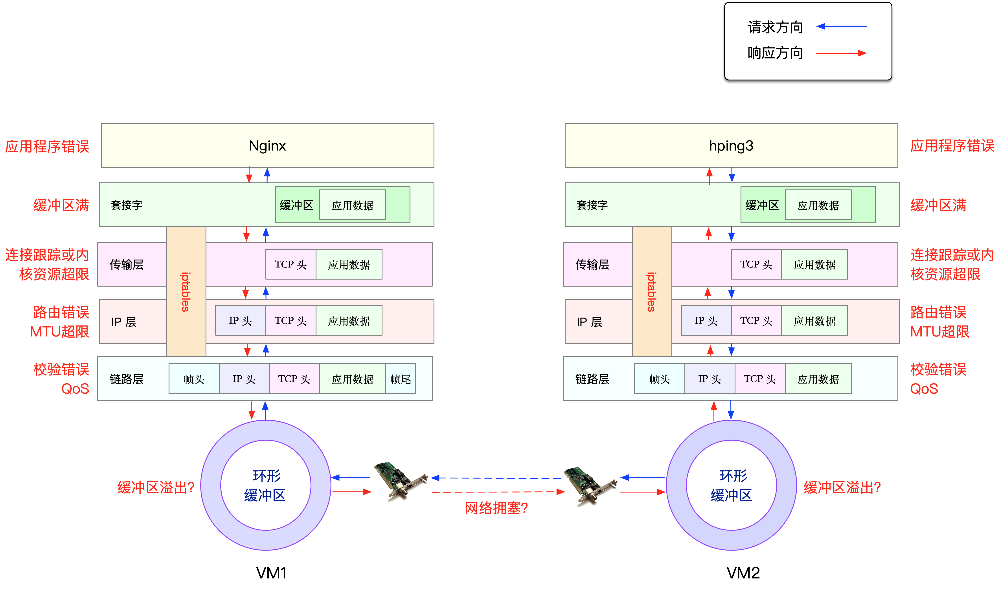
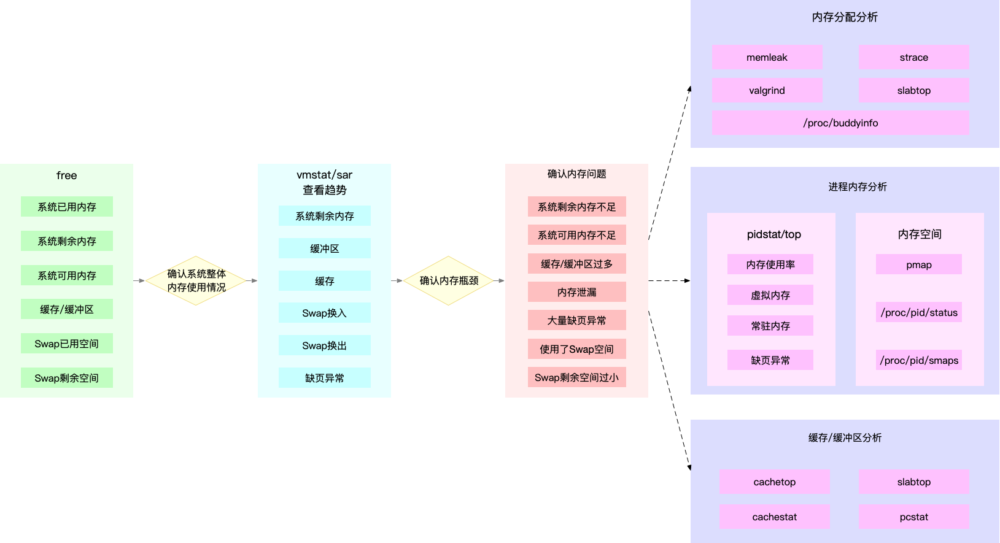

# Linux 入门必看：如何60秒内分析Linux性能

https://netflixtechblog.com/linux-performance-analysis-in-60-000-milliseconds-accc10403c55

https://mp.weixin.qq.com/s/HvADkICPYflS2VTuSB16rg

http://www.brendangregg.com/tsamethod.html

# 排查步骤

vmstat     -->     top   -->  pidstat

​     通过vmstat查看整体CPU, 内存, io,使用情况，top查看CPU占用高的几个进程，pidstat查看这几个进程对应的线程。

监控CPU性能包括以下几个部分：

a. 检查CPU的run queue，每个CPU的run queue最好不要超过3个进程。

b. 确定CPU利用率在usr/sys = 65% / 35% ~ 70% / 30%之间。

c. 当CPU的处理时间更多的是在system空间，说明已经超负荷。

d. 当I/O增多时，CPU密集型的应用将受到影响。

e. 当CPU的IOWait占用比较大的比例时，说明IO出现异常。

# 碰到上下文切换次数过多

可以借助 vmstat  、  pidstat 和 /proc/interrupts 等工具，来辅助排查性能问题的根源。

## Kworker占用了CPU, 同时大量的自愿切换

排查过程:

- top 发现僵尸进程和kworker

- `kill -9` 发现杀不死

- ps 发现是docker中的java,  再杀父进程,不OK, 

  

  根据进程号`ps -ef | grep PID`找到docker ID

  `docker stop Conatiner ID`关不掉

  思考是不是因为kwoker

- `pidstat -w` 发现上下文切换很高

- `perf record -ag -- sleep 15; perf report` 没有发现什么有价值且能看懂的信息

- google

  - [Kworker, what is it and why is it hogging so much CPU?](https://askubuntu.com/questions/33640/kworker-what-is-it-and-why-is-it-hogging-so-much-cpu)
  - 第一个答案介绍kworker, 看到了重启大法, 稍后再试
  - 第二个答案, 给出了他的解决方案,实验无果
  - 第三个答案, 说因为NFS挂载的原因, -->想到自己的挂载卷
  - `df -Th` 验证处于 夯住的状态
  - `cat /etc/mtab` 结合前面的容器名字 找到挂载的卷
  
- 使用 umount -f PATH 卸载

  ```
  ~ umount -f /webserver/page
  ```
强制卸载, 如果执行此命令后, 还是提示磁盘"busily" 就使用以下命令卸载

  使用 umount -l PATH 卸载

  ```
 ~ umount -l /webserver/page
  ```
  
- 僵尸进程没有了

- kworker 依旧很高

- 重启

- 事后继续查看perf 发现

  

  
  
  以目前的经验分析, 的确和nfs有关,因为nfs依赖于rpc, 强制卸载盘后依旧无法释放连接

# CPU使用率过高怎么办

pref

# 进程的 PID 在变，这说明什么呢？

- 要么是这些进程在不停地重启，要么就是全新的进程，这无非也就两个原因：
  - 进程在不停地崩溃重启，比如因为段错误、配置错误等等，这时，进程在退出后可能又被监控系统自动重启了。
  - 这些进程都是短时进程，也就是在其他应用内部通过 exec 调用的外面命令。这些命令一般都只运行很短的时间就会结束，你很难用 top 这种间隔时间比较长的工具发现

# 碰见iowait升高怎么办

- 碰到 iowait 升高时，需要先用 dstat、pidstat 等工具，确认是不是磁盘 I/O 的问题，然后再找是哪些进程导致了 I/O。
- 确定是不是内存满了， swap问题
- 等待 I/O 的进程一般是不可中断状态，所以用 ps 命令找到的 D 状态（即不可中断状态）的进程，多为可疑进程。但这个案例中，在 I/O 操作后，进程又变成了僵尸进程，所以不能用 strace 直接分析这个进程的系统调用。这种情况下，我们用了 perf 工具，来分析系统的 CPU 时钟事件，最终发现是直接 I/O 导致的问题。这时，再检查源码中对应位置的问题，就很轻松了。而僵尸进程的问题相对容易排查，使用 pstree 找出父进程后，去查看父进程的代码，检查 wait() / waitpid() 的调用，或是 SIGCHLD 信号处理函数的注册就行了。

# 网络丢包怎么办

网络丢包可能发生在网络传输的**任何一个过程**



## 链路层

### 查看网卡统计信息

```
# 查看网卡 包 统计信息, 
$ netstat -i 
$ ethtool DEVNAME
$ ethtool -S DEVNAME
```

> 注意，由于 Docker 容器的虚拟网卡，实际上是一对 veth pair，一端接入容器中用作 eth0，另一端在主机中接入 docker0 网桥中。veth 驱动并没有实现网络统计的功能，所以使用 ethtool -S 命令，无法得到网卡收发数据的汇总信息。

### 查看不被网卡统计的信息

如果**用 tc 等工具配置了 QoS**，那么 tc 规则导致的丢包，就不会包含在网卡的统计信息中。

```
root@nginx:/# tc -s qdisc show dev eth0
qdisc netem 800d: root refcnt 2 limit 1000 loss 30%
 Sent 432 bytes 8 pkt (dropped 4, overlimits 0 requeues 0)
 backlog 0b 0p requeues 0
```

从 tc 的输出中可以看到， eth0 上面配置了一个网络模拟排队规则（qdisc netem），并且配置了丢包率为 30%（loss 30%）。再看后面的统计信息，发送了 8 个包，但是丢了 4 个。看来，应该就是这里，导致 Nginx 回复的响应包，被 netem 模块给丢了。

解决办法，删除相关规则

`root@nginx:/# tc qdisc del dev eth0 root netem loss 30%`

### 传输层

重新测试，问题依旧没有消失

```
# 查看 协议 的收发汇总
$ netstat -s
```

只有 TCP 协议发生了丢包和重传，分别是：
11 次连接失败重试（11 failed connection attempts）
4 次重传（4 segments retransmitted）
11 次半连接重置（11 resets received for embryonic SYN_RECV sockets）
4 次 SYN 重传（TCPSynRetrans）
7 次超时（TCPTimeouts）

### iptables和内核的连接追踪机制

查看是不是内核的限制: 即对比下当前的连接追踪数和最大连接追踪数

```
# 主机终端中查询内核配置
$ sysctl net.netfilter.nf_conntrack_max
net.netfilter.nf_conntrack_max = 262144
$ sysctl net.netfilter.nf_conntrack_count
net.netfilter.nf_conntrack_count = 182
```

那接下来看下iptables

基于Netfilter框架，通过一系列的规则(四表5链)，对网络数据包进行过滤(如防火墙)和修改(如NAT)

统一管理在一系列的表中，包括 filter（用于过滤）、nat（用于 NAT）、mangle（用于修改分组数据） 和 raw（用于原始数据包）等。而每张表又可以包括pre-routing,  input,FORWARD, output, post-routing的链，用于对 iptables 规则进行分组管理。
- PREROUTING:数据包进入路由表之前 
- INPUT:通过路由表后目的地为本机
- FORWARD:通过路由表后，目的地不为本机
- OUTPUT:由本机产生，向外转发
- POSTROUTIONG:发送到网卡接口之前


```
root@nginx:/# iptables -t filter -nvL
Chain INPUT (policy ACCEPT 25 packets, 1000 bytes)
 pkts bytes target     prot opt in     out     source               destination
    6   240 DROP       all  --  *      *       0.0.0.0/0            0.0.0.0/0            statistic mode random probability 0.29999999981

Chain FORWARD (policy ACCEPT 0 packets, 0 bytes)
 pkts bytes target     prot opt in     out     source               destination

Chain OUTPUT (policy ACCEPT 15 packets, 660 bytes)
 pkts bytes target     prot opt in     out     source               destination
    6   264 DROP       all  --  *      *       0.0.0.0/0            0.0.0.0/0            statistic mode random probability 0.29999999981
```


# CPU 的性能分析

1. top 看一眼load average 

2. top + 1看**cpu使用率**

3. us 高 说明 用户程序比较繁忙

   sy 高  说明 内核比较繁忙   --> pidstat -wut 抓进程

   io 高 **通常**说明系统与硬件设备的 I/O 交互时间比较长。  pidstat -d 抓进程

   si/hi 软中断 硬中断, --> watch -d cat /proc/softirqs 

4.  去看 **上下文**

5. cpu **缓存的命中率**

   

# 内存的性能分析

1. 先用 free 和 top，查看系统整体的内存使用情况。
2. vmstat 和 pidstat，查看一段时间的趋势，从而判断出内存问题的类型。
3. 最后进行详细分析，比如内存分配分析、缓存 / 缓冲区分析、具体进程的内存使用分析等。



# io性能分析


