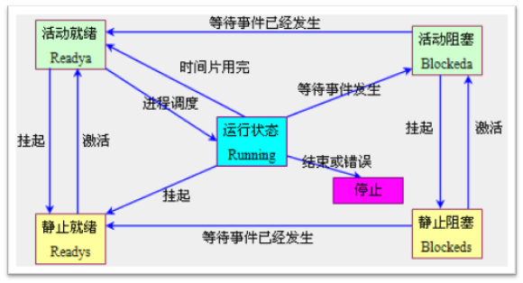
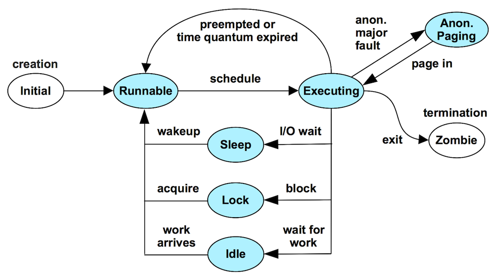

进程

- 每个进程都有一个父进程
- 当子进程终止时,父进程会得到通知并能取得子进程的退出状态

命名空间--> PID, UTC

进程组

- 每个进程也属于一个进程组
- 每个进程主都有一个进程组号,改号等于该进程组组长的PID号
- 一个进程只能为它自己或子进程设置进程组ID号

进程组组长-groupleader

会话期

- 对话期(session)是一个或多个进程组的集合
- setid()函数可以建立一个对话期

# 程序application

编译好的二进制文件,在磁盘上,不占用系统资源(内存,打开的文件,设备,锁)

# 进程 programming

这是一个抽象的概念,与操作系统原理联系紧密, 进程是活跃的程序, 占用系统资源,在内存中执行,**(程序运行起来,就产生一个进程)**

- 程序-> 剧本
- 进程-> 戏 (舞台,演员, 灯光, 道具...)

同一个剧本可以在多个舞台同时上演, 同样, 同一个程序也可以**加载为不通的进程** (彼此之间互不影响)

如: 同时开两个终端, 各自都有一个bash, 但彼此ID不同.

## 进程状态/ 3或者5种

初始态, 就绪态, 运行态, 挂起态, 终止态, 其中初始态为进程准备阶段, 常与就绪状态结合来看

window下的进程只是提供 执行环境, window下必定分配线程

# 线程 thread

最开始是window的概念,Unix/Linux是模拟出来的, 本质仍是进程

进程: 独立地址空间,拥有PCB

线程: 有独立的PCB, 但没有独立的地址空间(共享)

区别: 在于是否共享地址空间, 独居(进程); 合租(线程)

==hlighted weight process: LWP轻量级的进程,  最小的执行单位-- CPU分配时间轮片的对象==

==进程: 最小的系统资源分配单位== 可看成是只有一个线程的进程

## 线程同步

即**协同步调**,按预定的先后顺序运行

**线程同步, 指一个线程发出某一功能调用时, 在没有得到结果之前,该调用不返回,同时其他线程为保护数据一致性, 不能调用该功能**

"同步"的目的, 是为了避免数据混乱, 解决与时间有关的错误,实际上,不仅线程间需要同步, 进程间, 信号间等等都需要同步机制.

因此, 所有"多个控制流, 共同操作一个共享资源" 的情况, 都需要同步

# 锁的应用

## 互斥量Mutex

- 互斥锁

  建议锁, 拿到锁, 才能访问数据, 没有拿到锁的线程, 阻塞等待, 等到拿锁的线程释放锁

- 读写锁

  写独占,读共享, 写锁优先级高	

# 协程 coroutine

轻量级线程

一个线程可以有任意多个协程, 但**某一时刻只能有一个协程在运行, 多个协程分配线程得到的计算机资源**

==协程提高了程序执行的效率==进而节省了时间

不要直接理解为节省了时间

# 总结

在一次并发任务中,进程 线程 协程均可实现, 从系统资源消耗的角度出发看, 进程相当多,线程次之,协程最少

