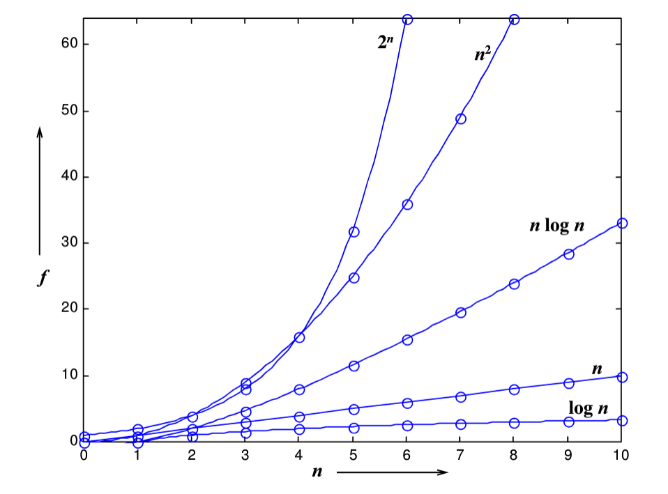

任何程序都可以用以下方式进程处理，program就是一个抽象再优化的过程

1. 解决问题的效率跟数据的组织结构有关
2. 解决问题方法的效率跟空间的利用效率有关
3. 解决问题方法的效率跟算法的巧妙程度有关

---

# 抽象数据类型(abstract Data Type)

## 数据类型
 - 数据对象集
 - 数据集合相关联的操作集

## 抽象: 描述数据类型的方法不依赖于具体实现
-	与存放数据的机器无关
-	与数据存储的物理结构无关
-	与实现操作的算法和编程语言均无关

> 只描述数据对象及和相关操作集**是什么**,并不设计**如何做到**的问题.

# 算法(Algorithm)

- 一个有限指令集
- 接受一些输入
- 产生输出
- 一定在优先步骤之后终止
- 每一条指令必须
  - 有充分明确的目标,不可以有歧义
  - 计算机能处理的范围之内
  - 描述应不依赖于任何一种计算机语言以及具体的实现手段

（1）建立数学模型来描述问题。
  （2）把求解的问题分成若干个子问题。
  （3）对每一子问题求解，得到子问题的局部最优解。
  （4）把子问题的局部最优解合成原来问题的一个解。